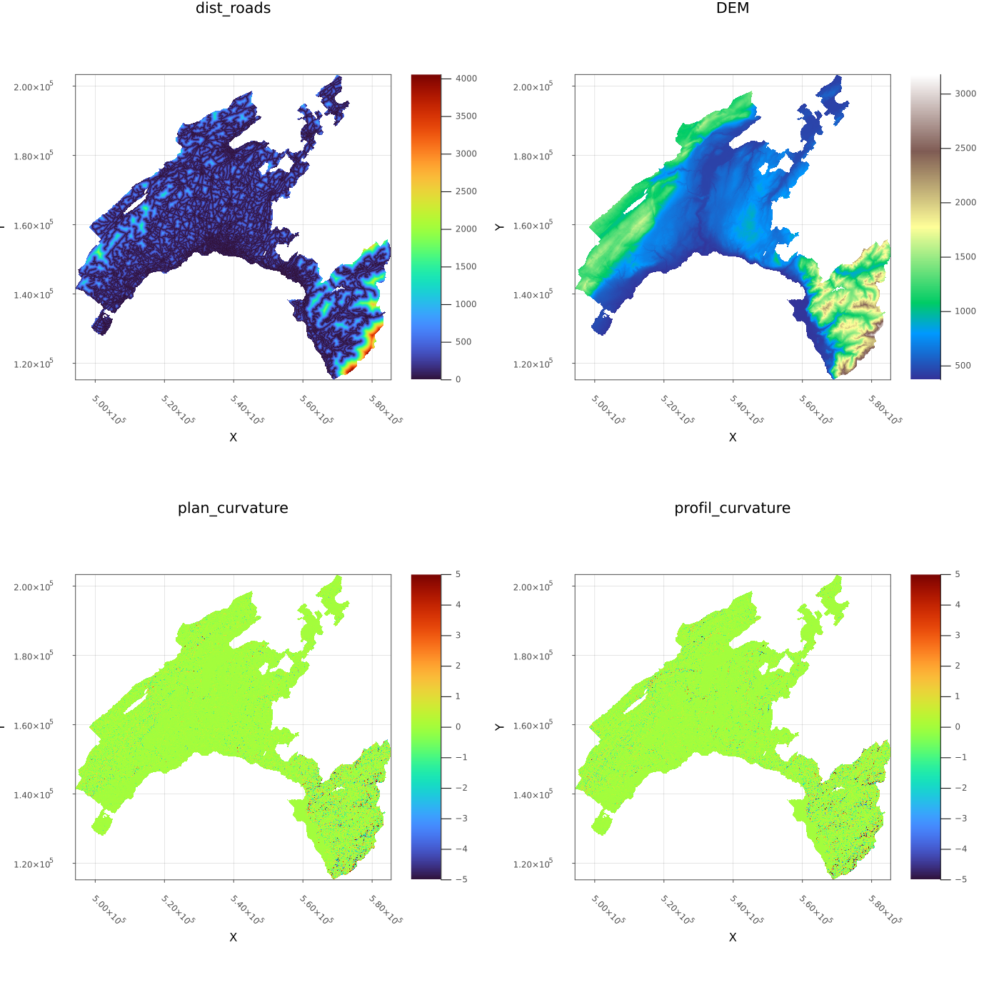
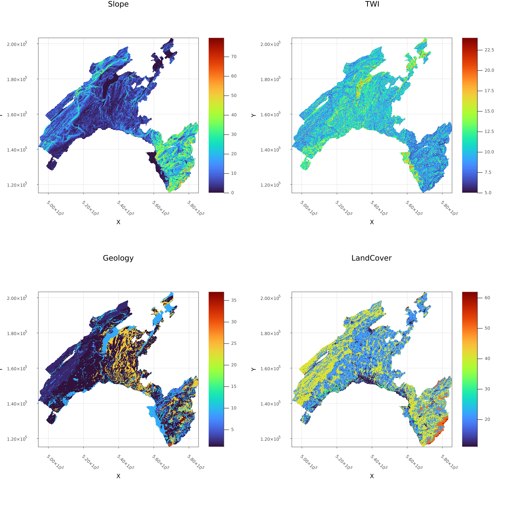
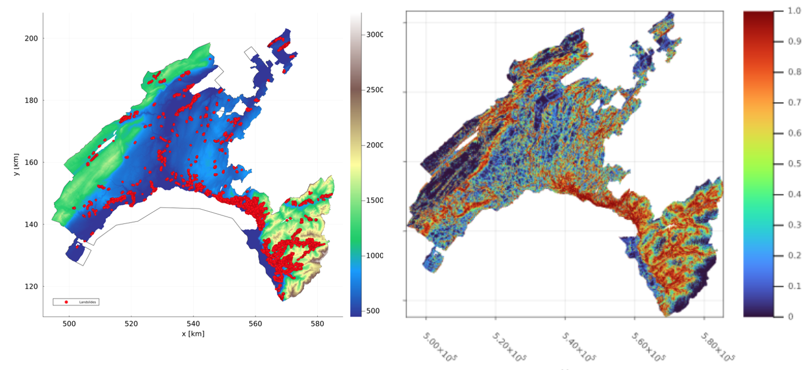
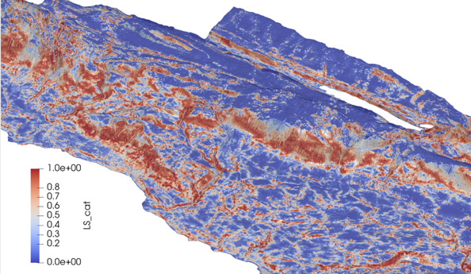
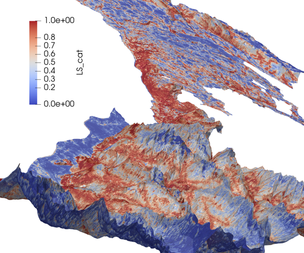

# Landslides_ANN

This repository contains scripts for training, testing and applying an Artificial Neuron Network (ANN) to predict the occurrence of landslides.
The models is build using [Flux](https://fluxml.ai/Flux.jl/stable/) which is Machine Learning library written in [Julia](https://julialang.org/).

The model was trained and tested (see [notebooks](/training)) using [`data/Landslides.csv'](/data/Landslides.csv). It was then be applied to the entire canton de Vaud using the following informations:

 

The final model (probability of occurrence) can be compared to the data (i.e. observations of landslides):

Finally, a 3D model was constructed and can be visualised using [ParaView](https://www.paraview.org/):

  
